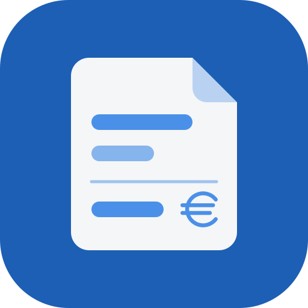
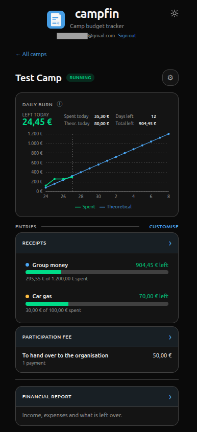
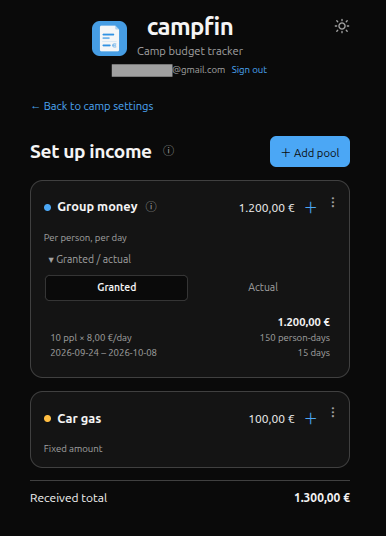
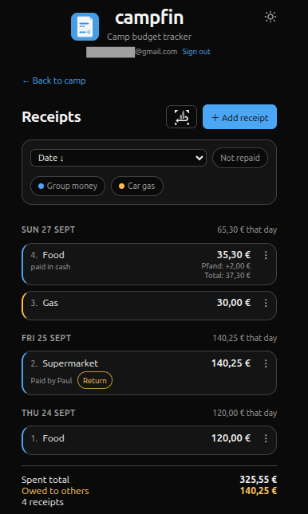
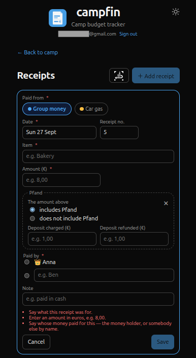
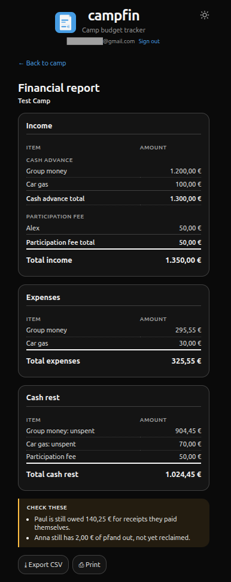
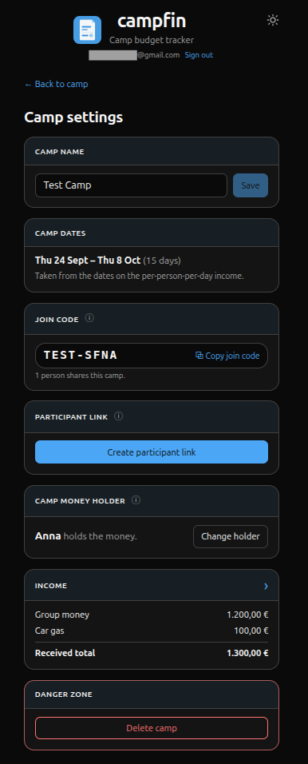

  

<h1 align="center">campfin</h1>

<strong>A pocket money book for a workcamp.</strong>

  📱 Works on any phone &nbsp;·&nbsp; 👥 Shared between leaders &nbsp;·&nbsp; 📶 Works offline

### 💡 Why I built it

While leading a volunteer workcamp I wanted to keep track of the camp's money digitally. It
started as an **Excel table** — it worked, but it was complicated and hard to adapt to other
camps. So I built an app instead: one that **works on every phone**, is **easy to use** and
**fits any camp**. That's how _campfin_ was born! I have already used it in the field and am
really happy with the result, so I'm publishing it here for anyone who might find it useful.

### 🧾 The problem

When you run a volunteer workcamp, the organisation hands the group leaders money for food,
transport and everything else the group needs. During the camp you must:

- **collect a receipt** for every purchase,
- **watch the budget**, so the money does not run out early,
- and afterwards **hand everything back** — the organisation checks the receipts against
  what was spent, and you return whatever is left.

### ✅ How campfin helps

campfin does this bookkeeping on your phone.

- ☁️ **Shared** — the data lives in the cloud, so several leaders of the same camp use it
  together.
- 📶 **Offline** — each phone keeps its own copy, so the app keeps working with no signal.
  Changes made offline are sent as soon as the phone is back online.

  

## How it is used

Anna and Paul lead a 15-day camp for 10 people. The organisation gives €8 per person per
day for food, and €100 for petrol.

1. **Set up the camp.** Anna creates the camp and notes that she holds the money. She then
   splits the income into pools: *Group money*, counted per person per day (10 people ×
   €8 × 15 days = €1 200), and *Car gas*, a fixed €100. She sends Paul the camp's join code,
   and from then on they both work on the same camp.
2. **Add every receipt.** After each purchase, whoever has the receipt adds it to the app
   and picks the pool the money came from. A few things can be noted on a receipt:
   - **Who paid.** Paul paid €140.25 at the supermarket out of his own pocket, so the
     receipt says *Paid by Paul*. It stays marked until Anna pays him back and taps
     *Return*.
   - **Pfand.** A receipt can carry a bottle deposit (*Pfand*). campfin remembers who paid
     it until the bottles are taken back to a shop, on its own Pfand screen.
   - **Other expenses.** Sometimes something has to be bought that no pool was planned
     for. Such a receipt goes on a separate *Other expenses* list instead: whoever paid is
     noted, and the organisation hopefully settles it after the camp.
3. **Keep an eye on the budget.** The dashboard shows how much is left for today and a
   chart of real spending against the plan, so overspending shows up early. If only 8 people
   turn up instead of 10, enter the real number: the money for the two missing people is
   kept aside to be returned, rather than counted as spendable.
4. **Keep money outside the budget apart.** A deposit handed over by the organisation, or
   the participation fee a participant pays, gets its own card on the dashboard, just like the
   other expenses from step 2. All of them are counted in the report but never mixed with
   the pools. Cards a camp does not need can be hidden with *Customise*.
5. **Share the budget with the participants.** A participant link, made in the camp
   settings, lets the campers open the chart and the receipts without signing in. It stops working after the camp's last day.
6. **Close the camp.** The financial report lists all income, all expenses and the cash
   that should go back to the organisation. It also warns about loose ends, such as Paul
   still being owed money or pfand not yet returned. Export it as CSV or print it.

## Screenshots

| Income set-up | Receipts | New receipt |
|:---:|:---:|:---:|
|  |  |  |

More: financial report, camp settings

| Financial report | Camp settings |
|:---:|:---:|
|  |  |

## For developers

campfin is a local-first PWA built with React, TypeScript and
[InstantDB](https://instantdb.com).

Read in this order:

1. [Development](docs/development.md) — stack, code layout, running it locally, the admin
   account, commands
2. [Environments](docs/environments.md) — production and optional dev databases, hosting, CI
3. [Deploying](docs/deploying.md) — first deployment, Telegram signup alerts

## License

[MIT](LICENSE) © 2026 Sergei Kuznetsov
